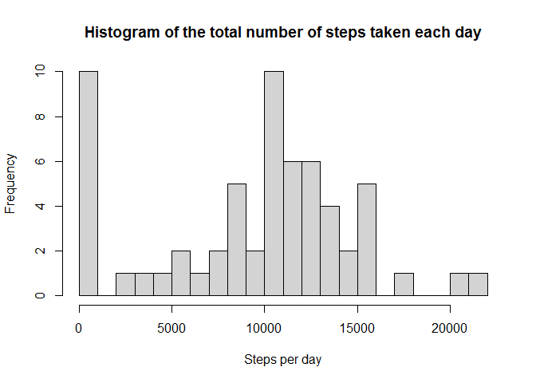
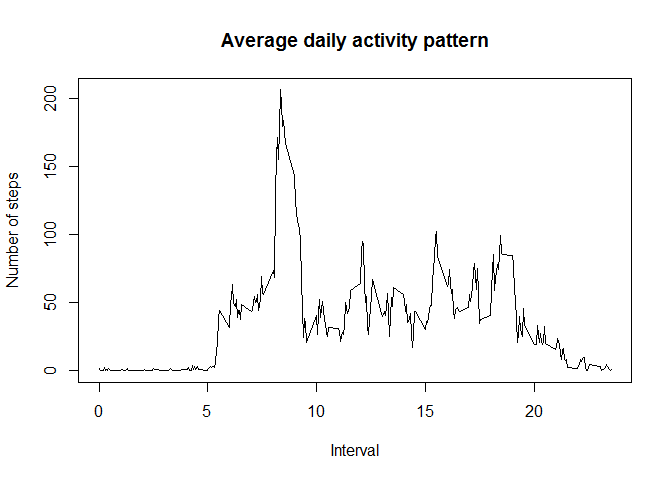
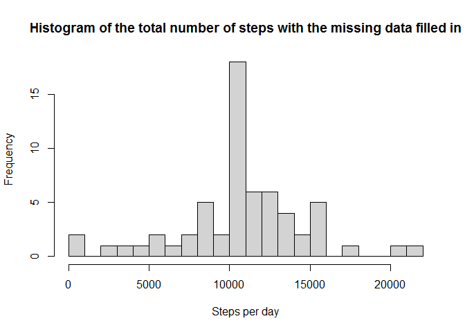
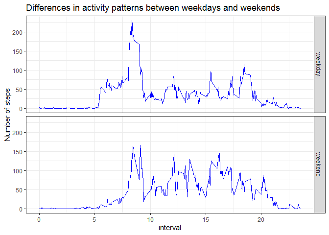

 
## Loading and preprocessing the data

```r
unzip(zipfile = "repdata_data_activity.zip")
df <- read.csv("activity.csv")
df$interval <- df$interval/100
```


## What is mean total number of steps taken per day?

```r
library(dplyr)
```

```
## 
## Attaching package: 'dplyr'
```

```
## The following objects are masked from 'package:stats':
## 
##     filter, lag
```

```
## The following objects are masked from 'package:base':
## 
##     intersect, setdiff, setequal, union
```

```r
df_daily <- df %>% 
    group_by(date) %>% 
    summarise(day_steps = sum(steps, na.rm = TRUE)) %>% 
    ungroup()
```

```
## `summarise()` ungrouping output (override with `.groups` argument)
```

```r
hist(df_daily$day_steps, breaks = 20, xlab = "Steps per day",
     main = "Histogram of the total number of steps taken each day")
```

<!-- -->

```r
daily_mean <- as.integer(mean(df_daily$day_steps))
daily_median <- median(df_daily$day_steps)
```

The mean of the total number of steps taken per day is 9354 and median is 10395


## What is the average daily activity pattern?

```r
df_interval <- df %>% 
    group_by(interval) %>% 
    summarise(int_steps = mean(steps, na.rm = TRUE)) %>% 
    ungroup()
```

```
## `summarise()` ungrouping output (override with `.groups` argument)
```

```r
plot(x = df_interval$interval, y = df_interval$int_steps, type = "l",
     main = "Average daily activity pattern", xlab = "Interval", ylab = "Number of steps")
```

<!-- -->

```r
max_int <- df_interval$interval[which.max(df_interval$int_steps)]
```

5-minute interval at 8.35 contains the maximum number of steps


## Imputing missing values

```r
miss_number <- nrow(df[!complete.cases(df$steps),])
```

The total number of missing values in the dataset is 2304.

I use the mean for that 5-minute interval for filling in all of the missing values in the dataset


```r
df_imp_miss <- df
df_imp_miss[is.na(df_imp_miss$steps),1] <- df_interval[,2]
df_daily_imp_miss <- df_imp_miss %>% 
    group_by(date) %>% 
    summarise(day_steps = sum(steps)) %>% 
    ungroup()
```

```
## `summarise()` ungrouping output (override with `.groups` argument)
```

```r
hist(df_daily_imp_miss$day_steps, breaks = 20, xlab = "Steps per day",
     main = "Histogram of the total number of steps with the missing data filled in")
```

<!-- -->

```r
daily_mean_imp_miss <- as.integer(mean(df_daily_imp_miss$day_steps))
daily_median_imp_miss <- as.integer(median(df_daily_imp_miss$day_steps))
```

 The mean and median total number of steps taken per day  is 10766 and the median is 10766 (the same).  
 They are expected to be slightly higher than similar estimates from the first part.


## Are there differences in activity patterns between weekdays and weekends?

```r
Sys.setlocale("LC_TIME", "English")
```

```
## [1] "English_United States.1252"
```

```r
df_imp_miss$wd <- ifelse(weekdays(as.Date(df$date), abbreviate = TRUE) %in% c("Sat", "Sun"), "weekend",
                         "weekday")
df_interval_imp_miss <- df_imp_miss%>% 
    group_by(interval, wd) %>% 
    summarise(int_steps = mean(steps)) %>% 
    ungroup()
```

```
## `summarise()` regrouping output by 'interval' (override with `.groups` argument)
```

```r
library(ggplot2)
ggplot(df_interval_imp_miss, aes(interval, int_steps)) +
    geom_line(colour = "blue")+
    facet_grid(vars(wd)) +
    labs(title = "Differences in activity patterns between weekdays and weekends", 
         y = "Number of steps") +
    theme_bw()
```

<!-- -->

 We see some differences in activity patterns between weekdays and weekends.
